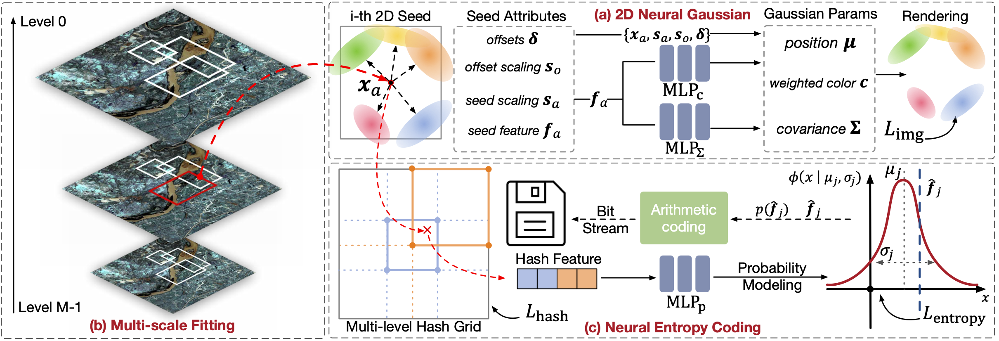
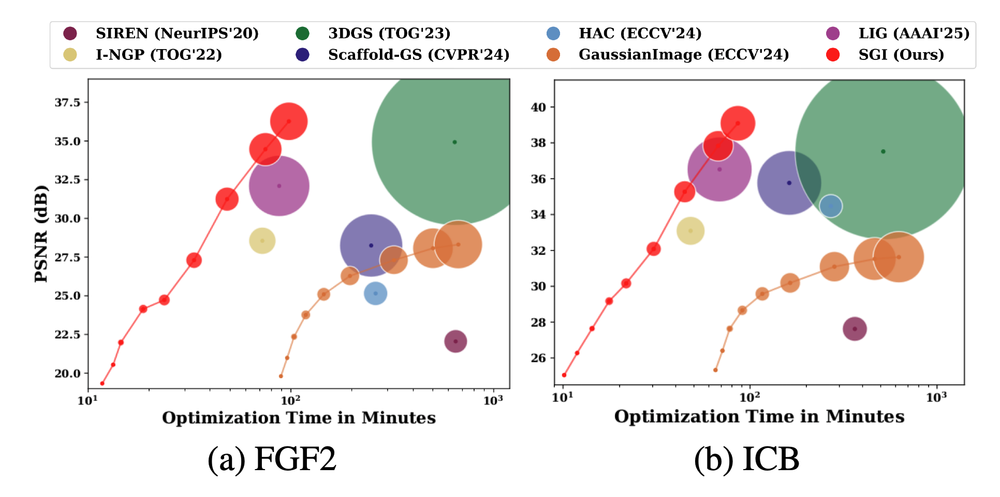

# [CVPR 2026] SGI

Official Pytorch implementation of [**SGI: Structured 2D Gaussians for Efficient and Compact Large Image Representation**](https://arxiv.org/pdf/2603.07789).

[Zixuan Pan*](https://scholar.google.com/citations?hl=en&user=3VuW2gcAAAAJ), [Kaiyuan Tang*](https://scholar.google.com/citations?user=M8M1ZwkAAAAJ&hl=en), [Jun Xia](https://junxia95.github.io), [Yifan Qin](https://yifanqin-nd.github.io), [Lin Gu](https://sites.google.com/view/linguedu/home), [Chaoli Wang](https://sites.nd.edu/chaoli-wang/), [Jianxu Chen](https://www.isas.de/en/the-institute/people/1569-jianxu-chen), [Yiyu Shi](https://scl-nd.github.io)

(* denotes equal contribution)

## Overview
<p align="left">

</p>

2D Gaussian Splatting has emerged as a novel image representation technique that can support efficient rendering on low-end devices. However, scaling to high-resolution images requires optimizing and storing millions of unstructured Gaussian primitives independently, leading to slow convergence and redundant parameters. To address this, we propose Structured Gaussian Image (SGI), a compact and efficient framework for representing high-resolution images. SGI decomposes a complex image into multi-scale local spaces defined by a set of seeds. Each seed corresponds to a spatially coherent region and, together with lightweight multi-layer perceptrons (MLPs), generates structured implicit 2D neural Gaussians. This seed-based formulation imposes structural regularity on otherwise unstructured Gaussian primitives, which facilitates entropy-based compression at the seed level to reduce the total storage. However, optimizing seed parameters directly on high-resolution images is a challenging and non-trivial task. Therefore, we designed a multi-scale fitting strategy that refines the seed representation in a coarse-to-fine manner, substantially accelerating convergence. Quantitative and qualitative evaluations demonstrate that SGI achieves up to 7.5 $\times$ compression over prior non-quantized 2D Gaussian methods and 1.6 $\times$ over quantized ones, while also delivering 1.6 $\times$ and 6.5 $\times$ faster optimization, respectively, without degrading, and often improving, image fidelity.

## Performance
<p align="left">

</p>


## Installation

We tested our code on a server with Ubuntu 20.04.1, cuda 11.8, gcc 9.4.0.

1. Unzip files

```
cd submodules
unzip diff-gaussian-rasterization.zip
unzip gridencoder.zip
unzip simple-knn.zip
unzip arithmetic.zip
cd ..
```

2. Install environment

```
conda env create --file environment.yml
conda activate SGI_env
```

3. Install gsplat2d

```
cd gsplat2d/gsplat2d/cuda/csrc
mkdir third_party
cd third_party
git clone https://github.com/g-truc/glm.git
cd ../../../..
python setup.py build
python setup.py install
```

4. Install `tmc3` (for GPCC)

- Please refer to [tmc3 github](https://github.com/MPEGGroup/mpeg-pcc-tmc13) for installation.
- Don't forget to add `tmc3` to your environment variable.
- Tips: `tmc3` is commonly located at `/PATH/TO/mpeg-pcc-tmc13/build/tmc3`.

## Data

The data structure should be organised as follows:

```
data/
├── dataset_name
│   ├── xxx_0.png
│   ├── xxx_1.png
│   ├── xxx_2.png
│   ├── ...
...
```

### Public Data

- The FGF2 dataset can be downloaded [here](https://data.tpdc.ac.cn/en/data/1b2ebe66-8389-4c9f-9756-1b29d83f851f/) 
- The ICB dataset can be downloaded [here](https://imagecompression.info/test_images/) 
- The STimage datasets can be downloaded [here](https://huggingface.co/datasets/jiawennnn/STimage-1K4M)

## Training

Set the path of tmc3 before running:

```
bash train.sh image_dir output_root
```

Notes:

- The pipeline runs **training, encoding, decoding, and evaluation**.
- Logs are written to `outputs.log` under each image's output directory.
- Encoded bitstreams are saved to `<model_path>/bitstreams`.
- Per-image metrics are saved to `<output_root>/metrics.json` and `<output_root>/metrics.csv`.
- For very large images, use `--disable_lpips` to skip LPIPS and avoid potential GPU OOM during evaluation.

## Acknowledgement

This codebase is built upon several excellent open-source projects, including [LIG](https://github.com/HKU-MedAI/LIG), [GaussianImage](https://github.com/Xinjie-Q/GaussianImage), [gsplat](https://github.com/nerfstudio-project/gsplat), and [HAC-plus](https://github.com/YihangChen-ee/HAC-plus). We sincerely thank the authors of these works for making their code publicly available.

## Citation

If you use SGI algorithm in your research, please cite our paper:

```bibtex
@misc{pan2026sgistructured2dgaussians,
      title={SGI: Structured 2D Gaussians for Efficient and Compact Large Image Representation}, 
      author={Zixuan Pan and Kaiyuan Tang and Jun Xia and Yifan Qin and Lin Gu and Chaoli Wang and Jianxu Chen and Yiyu Shi},
      year={2026},
      eprint={2603.07789},
      archivePrefix={arXiv},
      primaryClass={cs.CV},
      url={https://arxiv.org/abs/2603.07789}, 
}
```
